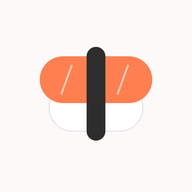
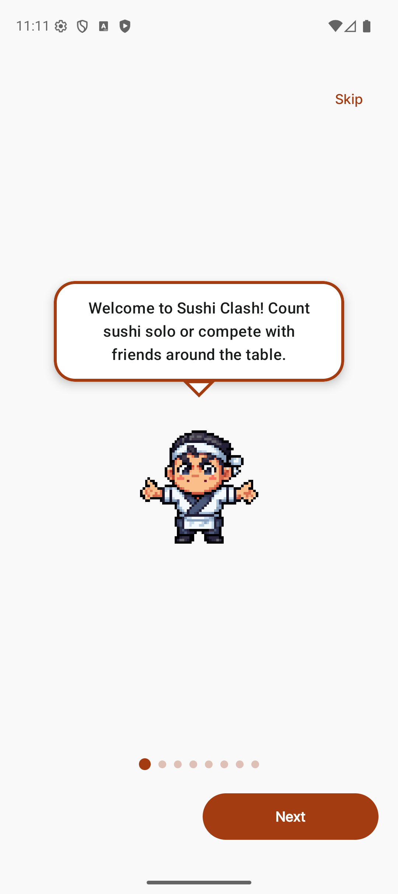
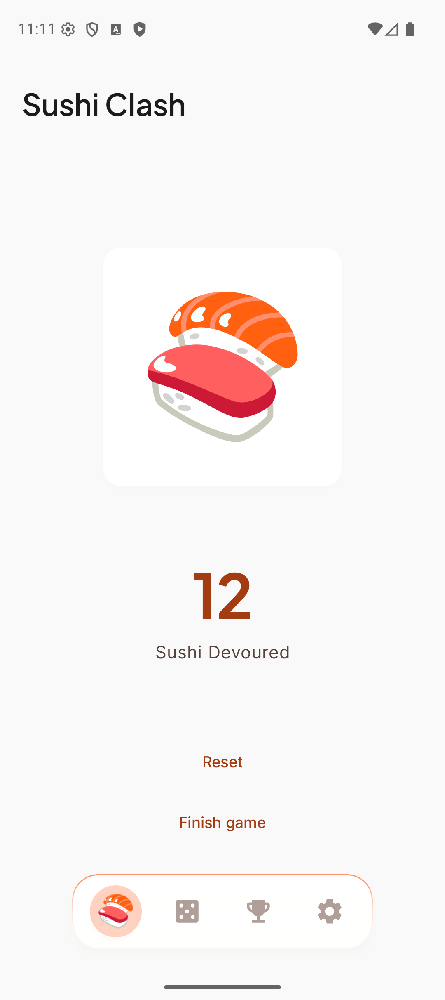
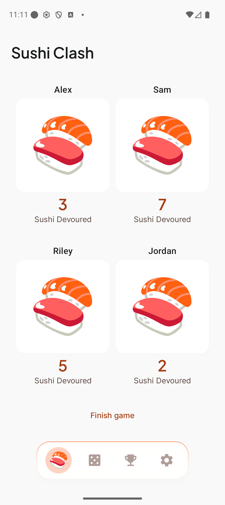
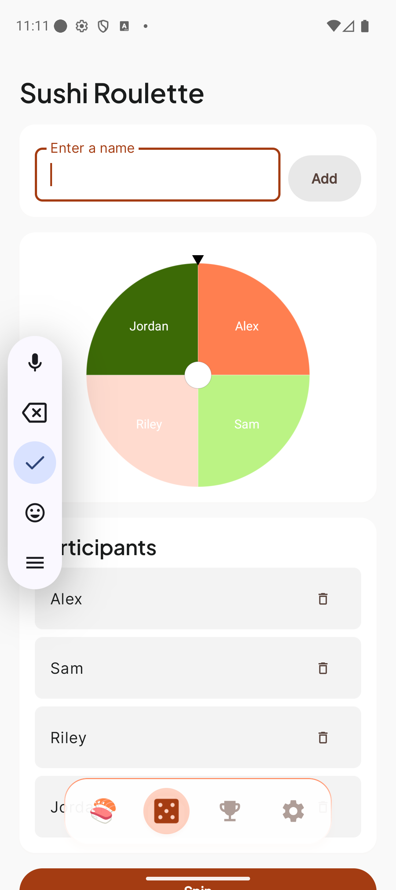
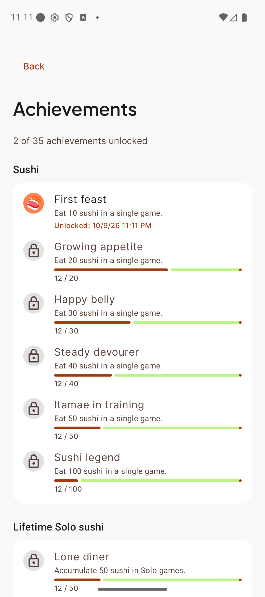
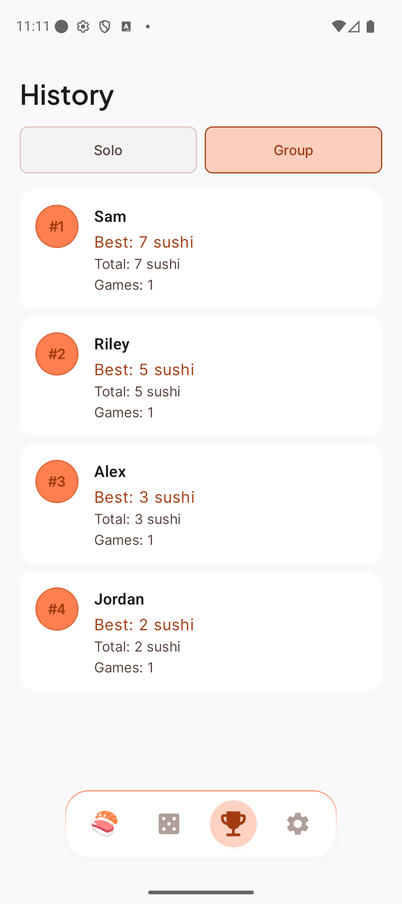
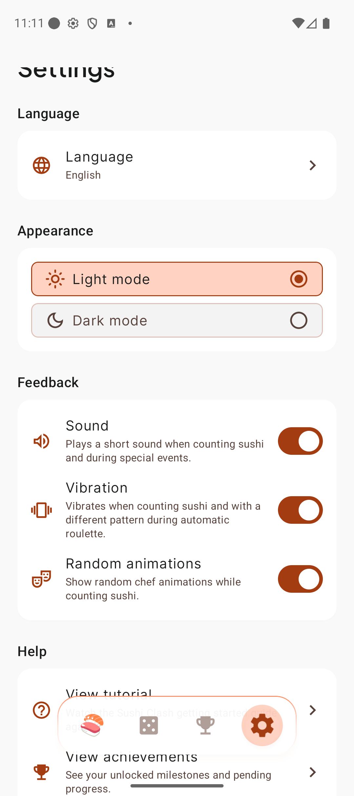
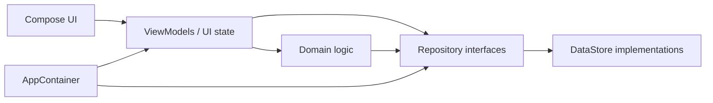

# 🍣 Sushi Clash

**Count sushi. Compete with friends. Let the chef spice up the table.**

Sushi Clash is a native Android app for tracking sushi eaten alone or with friends — turning a simple count into a playful, game-like session with a chef mascot, a decision roulette, achievements, and history.

Built with **Kotlin** and **Jetpack Compose** by [Mancebo Labs](https://github.com/ManceboLabs).

<p align="center">
  
</p>

<p align="center">
  
  
  
  
</p>

---

## About Sushi Clash

Sushi nights are fun — remembering who ate what is usually not. Sushi Clash keeps the count for you and adds just enough game energy to keep the table engaged.

Play Solo when you want a personal tally, or Group when the phone sits in the middle of the table. Between taps, a custom chef mascot reacts, a roulette can settle who goes next, and finished sessions land in local history with unlockable achievements.

Everything runs on the device. No account. No feed. No cloud gameplay.

---

## Features

### Gameplay
- **Solo mode** — tap the sushi to count every piece you eat; long-press to reset
- **Group mode** — up to **6** named players with independent counters
- **Active game persistence** — leave the app mid-session and return where you left off
- **Finish flow** — save to history or discard the result

### Roulette
- **Decision wheel** — add participants and spin to pick a winner
- **Automatic triggers** — optional fixed-threshold or progressive random triggers during counting
- **Winner celebration** — chef animation when the wheel settles

### Chef mascot & personality
- **Onboarding guide** — comic-style dialogue with animated chef GIFs
- **Game start / finish celebrations**
- **Random chef events while counting** — surprise animations with independent per-player scheduling in Group mode
- **Settings toggle** — disable random counting animations without turning off start, finish, roulette, or onboarding celebrations

### Progress & memory
- **35 achievements** — sushi peaks, lifetime totals, games completed, and roulette milestones
- **History & rankings** — saved Solo and Group results
- **Frequent players** — name suggestions for the next Group game

### App experience
- **Onboarding tutorial** — first launch, replayable from Settings
- **Floating bottom navigation** — Counter, Roulette, History, Settings
- **Light / dark theme**
- **Sound and vibration** toggles
- **6 languages** with per-app locale or follow the system language
- **Local-first / offline** — no login, ads, or analytics SDKs

---

## Chef mascot

Sushi Clash has an original pixel-art chef who shows up throughout the experience:

| Moment | Role |
|--------|------|
| Onboarding | Walks you through Solo, Group, roulette, history, and responsible use |
| Game start | Welcomes a new session |
| While counting | Random surprise events (optional in Settings) |
| Roulette winner | Celebrates the spin result |
| Game finish | Closes the session |

The mascot gives the app a small arcade personality without getting in the way of a fast tap-to-count flow.

> Animated chef assets live under `app/src/main/res/raw/` as GIFs used by the in-app renderer. They are not duplicated here for GitHub preview.

---

## Screenshots

<p align="center">
  
  
  
  
</p>
<p align="center">
  
  
  
</p>

Additional locales and regeneration steps are under [`docs/screenshots/`](docs/screenshots/).

---

## Tech stack

| Area | Choices |
|------|---------|
| Language | Kotlin |
| UI | Jetpack Compose, Material 3, custom **Itamae** design tokens |
| Architecture | Feature UI → ViewModels / UI state → domain rules → DataStore repositories |
| Async / state | Kotlin Coroutines, `StateFlow` |
| Navigation | Navigation Compose |
| Persistence | Preferences DataStore (+ AppCompat per-app locales) |
| Randomness | `RandomProvider` abstraction for deterministic tests |
| Testing | JUnit, MockK, Turbine, Compose UI tests, AndroidX Test Orchestrator |
| Build | Android Gradle Plugin 9, Gradle 9, R8 minify + resource shrink on release |
| Min / target SDK | **24 / 37** |

---

## Architecture



Package layout under `app/src/main/java/com/mancebolabs/sushiclash/`:

| Package | Responsibility |
|---------|----------------|
| `feature/` | Screens, ViewModels, feature UI state |
| `domain/` | Models, rules (setup, roulette, chef triggers, achievements), repository contracts |
| `data/` | DataStore access and repository implementations |
| `navigation/` | Routes, NavHost, main-tab transitions |
| `ui/` | Theme (Itamae), shared components, chef GIF renderer |
| `di/` | Manual wiring via `AppContainer` |

Composables render state and emit actions. Business rules stay out of UI code. Random chef intervals and wheel outcomes go through `RandomProvider` so unit and instrumented tests can stay deterministic.

---

## Local-first & privacy

- Gameplay data stays **on the device** (active game, history, player names, achievements, settings)
- **No** Mancebo Labs backend, accounts, ads, or analytics SDKs
- **No** runtime permissions declared in the manifest
- Android backup is enabled with explicit include rules; a restore marker avoids reviving stale in-progress games

Policy and Play Console notes in this repository:

- [Privacy Policy (source)](docs/privacy-policy/index.md)
- [Published Privacy Policy](https://mancebolabs.github.io/SushiClash/privacy-policy/)
- [Play Data Safety checklist](docs/PLAY_DATA_SAFETY.md)

---

## Localization

| Language | Role |
|----------|------|
| English | Base / fallback |
| Spanish | `values-es` |
| German | `values-de` |
| French | `values-fr` |
| Simplified Chinese | `values-zh-rCN` |
| Japanese | `values-ja` |

Per-app language selection (or follow the system) via AppCompat locales and `locales_config.xml`.

---

## Testing & quality

Current suite (counted from `@Test` methods in the repository):

| Layer | Count | Focus |
|-------|------:|-------|
| Unit | **316** | ViewModels, repositories, DataStore, setup rules, roulette, chef triggers, achievements, history, onboarding, settings, localization |
| Instrumented | **43** | Onboarding, Solo/Group flows, chef celebrations & random events, roulette, history, achievements, settings smoke, lifecycle, GIF reload |

```bash
./gradlew testDebugUnitTest
./gradlew lintDebug
./gradlew assembleDebug
```

Instrumented (device or emulator required):

```bash
./gradlew connectedDebugAndroidTest
```

**CI** (GitHub Actions on `main` and pull requests): unit tests, lint, and debug build. Release builds use R8; upload signing is configured locally via `keystore.properties` (see `keystore.properties.example`) — secrets are not in the repository.

---

## Building

**Requirements**

- JDK **17** (matches CI)
- Android SDK with API **37** platform
- Android Studio or a compatible IDE recommended

```bash
git clone https://github.com/ManceboLabs/SushiClash.git
cd SushiClash
./gradlew assembleDebug
./gradlew installDebug   # optional, connected device/emulator
```

Release artifacts (`assembleRelease` / `bundleRelease`) require a local upload keystore. Copy `keystore.properties.example` to `keystore.properties` and fill in the values — never commit that file.

---

## Project status

**Sushi Clash 1.0** — finished core product and portfolio project, preparing for Google Play.

| Item | Status |
|------|--------|
| Core gameplay (Solo / Group / roulette / chef) | Complete |
| Achievements, history, onboarding | Complete |
| Localization (6 languages) | Complete |
| Unit + instrumented regression suite | Complete |
| CI (unit tests, lint, debug build) | Complete |
| Release signing + R8 | Configured locally |
| Google Play listing | In progress |

<!-- When the Play Store page is live, add:
[](PLAY_STORE_URL)
-->

---

## Related documentation

- [Agent & contribution guidelines](AGENTS.md)
- [Development notes](DEVELOPMENT_NOTES.md)
- [Play Data Safety checklist](docs/PLAY_DATA_SAFETY.md)
- [Privacy Policy (source)](docs/privacy-policy/index.md)

---

## Mancebo Labs

Sushi Clash is developed and maintained by **[Mancebo Labs](https://github.com/ManceboLabs)**.

---

© 2026 Mancebo Labs. All rights reserved.

This repository is publicly available for portfolio and educational viewing.

No permission is granted to copy, modify, distribute, sublicense, or use this source code in other projects without prior written permission from the copyright holder.
